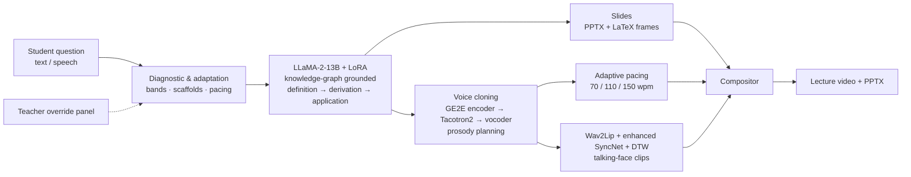

# K-12 AI Teaching Agent

Code for the article

> Hui Liu, Chuangqi Li, Ziyu Liu, Shuxiao Yang, Hao Wang & Pengrong Yan (2026).
> **Designing Multimodal Human–Computer Interaction for K–12 Learning: Research Design, System Architecture, and Field Evaluation of an AI Teaching Agent.**
> *International Journal of Human–Computer Interaction*. https://doi.org/10.1080/10447318.2026.2616662

The agent answers a student's maths question with an automatically generated slide deck, narrated in a cloned voice by a lip-synced virtual teacher:



> **Code availability note.** This repository is a re-implementation of the system described in the paper,
> rebuilt from the published description after the original source code was lost. Every equation and
> design element given in the paper is implemented; where the paper leaves details open, the choice made
> here is listed under [Reconstruction notes](#reconstruction-notes). No participant data are included.

## Repository layout

| Paper | What | Code |
|---|---|---|
| §2.1, §3.1 | Question comprehension, knowledge-graph retrieval | [`k12agent/content/knowledge_base.py`](k12agent/content/knowledge_base.py), [`data/math_kg.json`](k12agent/content/data/math_kg.json) |
| §2.1, Tables A2–A4 | Stage- and band-specific prompt templates | [`k12agent/content/prompts.py`](k12agent/content/prompts.py) |
| §3.1 | LLaMA-2-13B generator (4-bit, LoRA), JSON output contract | [`k12agent/content/generator.py`](k12agent/content/generator.py) |
| §3.1, Eqs. 1–3 | RoPE, SwiGLU, grouped-query attention (reference implementation) | [`k12agent/content/llama_layers.py`](k12agent/content/llama_layers.py) |
| §4 | Knowledge-graph-driven LoRA fine-tuning | [`k12agent/content/finetune.py`](k12agent/content/finetune.py) |
| §2.1 | Template mapping to PPTX, LaTeX formulas, visual signalling | [`k12agent/slides/`](k12agent/slides/) |
| §3.4, §4.5.1 | Pacing presets (70/110/150 wpm) and adaptive nonlinear dwell | [`k12agent/slides/pacing.py`](k12agent/slides/pacing.py) |
| §3.2, Eq. 4 | GE2E speaker encoder and loss | [`k12agent/speech/ge2e.py`](k12agent/speech/ge2e.py) |
| §3.2, Eq. 5, Fig. 4 | Prosody-aware Tacotron-2 attention / decoder | [`k12agent/speech/prosody_decoder.py`](k12agent/speech/prosody_decoder.py) |
| §2.2 | Formula verbalisation, pauses, emphasis (emotional modulation) | [`k12agent/speech/prosody.py`](k12agent/speech/prosody.py) |
| §2.2, §3.2 | 5-second voice cloning (Real-Time-Voice-Cloning / MockingBird), voice-match similarity | [`k12agent/speech/voice_cloner.py`](k12agent/speech/voice_cloner.py) |
| §3.3, Eqs. 6–8, Fig. 5 | Dual-stream Conv1D / ResNet-34 encoders, cross-modal attention, face decoder | [`k12agent/video/models.py`](k12agent/video/models.py) |
| §3.3–3.4, Fig. 6 | Enhanced SyncNet (φ, ψ), A/V offset in ms | [`k12agent/video/syncnet.py`](k12agent/video/syncnet.py) |
| §3.4, Eqs. 9–10 | Windowed sync loss, adversarial modality discriminator, DTW | [`k12agent/video/alignment.py`](k12agent/video/alignment.py) |
| §3.3 | Wav2Lip inference + DTW re-timing | [`k12agent/video/lipsync.py`](k12agent/video/lipsync.py) |
| §3.3–3.4 | Training of enhanced SyncNet and generator | [`k12agent/video/train_enhanced.py`](k12agent/video/train_enhanced.py) |
| §2.3 | Avatar overlay on slides → lecture video | [`k12agent/video/compositor.py`](k12agent/video/compositor.py) |
| §4.1.1 | Baseline diagnostic, bands (<50 / 50–79 / ≥80 %), mastery gating | [`k12agent/adaptive/diagnostic.py`](k12agent/adaptive/diagnostic.py) |
| §2, §4.1.2 | Instructor-in-the-loop override panel (preview, publish, audit log) | [`k12agent/adaptive/override.py`](k12agent/adaptive/override.py) |
| §4.5.1, Table 2 | Off-task rule (> 5 s), behaviour logs | [`k12agent/tracking/`](k12agent/tracking/) |
| §3.5, §4.1.3 | Subject hooks: physics units, chemistry balancing, sociology CER | [`k12agent/subjects/hooks.py`](k12agent/subjects/hooks.py) |
| Fig. 1–2 | End-to-end pipeline, CLI, web UI | [`k12agent/pipeline.py`](k12agent/pipeline.py), [`cli.py`](k12agent/cli.py), [`app/webui.py`](k12agent/app/webui.py) |
| §4.2, Eq. 11 | A-priori power analysis | [`analysis/power_analysis.py`](analysis/power_analysis.py) |
| §4.6, Tables 3–5 | Descriptives, Cohen's d, 3-way ANOVA / ANCOVA, planned contrasts, equity gaps | [`analysis/stats.py`](analysis/stats.py), [`run_analysis.py`](analysis/run_analysis.py) |
| Figs. 9–14 | Result figures | [`analysis/figures.py`](analysis/figures.py) |

## Installation

```bash
git clone https://github.com/<your-account>/K12-AI-Teaching-Agent.git
cd K12-AI-Teaching-Agent
python -m venv .venv && source .venv/bin/activate
pip install -r requirements.txt          # or: pip install -e ".[llm,ui,dev]"
pytest                                   # 26 tests, CPU only, ~10 s
```

For the full multimodal system (GPU recommended):

```bash
bash scripts/setup_third_party.sh        # Wav2Lip + Real-Time-Voice-Cloning (+ --zh for MockingBird)
huggingface-cli login                    # access to meta-llama/Llama-2-13b-hf
```

Then place `wav2lip_gan.pth` in `third_party/Wav2Lip/checkpoints/` and a default avatar / voice in [`assets/`](assets/README.md).

## Quick start

```bash
# Offline smoke test - no GPU, no model weights (knowledge-graph content, silent narration)
python -m k12agent --config configs/offline_demo.yaml ask "勾股定理是怎么推导出来的？" --grade 8

# Full system
python -m k12agent ask "How is the Pythagorean theorem derived?" --grade 8 --lang en \
    --voice my_voice_5s.wav --face teacher.jpg --pace medium

# Mandarin voices (MockingBird)
python -m k12agent --config configs/zh_mockingbird.yaml ask "什么是导数？" --grade 11 --face teacher.jpg

# Baseline diagnostic in the terminal / web UI with student, diagnostic and teacher-override tabs
python -m k12agent quiz --grade 5
python -m k12agent ui --port 7860
```

Each answer is written to `outputs/<question-id>/`: `lesson.pptx`, `lecture.mp4`, slide PNGs, per-slide narration WAVs,
avatar clips and `lesson.json` (the full I/O record, including voice-similarity and A/V-offset metrics).

Python API: see [`examples/quickstart.py`](examples/quickstart.py).

## Training

```bash
# 1. LoRA fine-tuning of LLaMA-2-13B (seed set bootstrapped from the knowledge graph + your own data)
python -m k12agent.content.finetune --bootstrap-from-kg --train data/sft_train.jsonl \
    --model meta-llama/Llama-2-13b-hf --output checkpoints/llama13b-math-lora
#    then set content.lora_adapter: checkpoints/llama13b-math-lora

# 2. Enhanced SyncNet with Eq. (9) + Eq. (10), then the enhanced generator (LRS2-style data, Wav2Lip preprocessing)
python -m k12agent.video.train_enhanced --stage syncnet   --data-root lrs2_preprocessed --filelist filelists/train.txt
python -m k12agent.video.train_enhanced --stage generator --data-root lrs2_preprocessed --filelist filelists/train.txt \
    --syncnet-ckpt checkpoints/lipsync/syncnet_ep49.pth
#    then set video.enhanced_checkpoint
```

## Reproducing the statistics

```bash
python -m analysis.power_analysis              # N = 288 (24 per cell), Section 4.2
python -m analysis.run_analysis --summary      # Section 4.6 indicators from Tables 3-5
python -m analysis.run_analysis --data scores.csv --out results/   # full analysis on the score sheet
```

`--summary` recomputes the reported indicators from the cell statistics of Tables 3–5:

| Stage | Traditional | AI agent | Δ | Cohen's d | Urban–rural gap (trad → AI) |
|---|---|---|---|---|---|
| Grade 5 | 93.64 | 96.20 | +2.56 | 0.87 | 1.55 → 0.85 |
| Grade 8 | 85.58 | 89.68 | +4.09 | 0.66 | 1.77 → 0.37 |
| Grade 11 | 74.46 | 65.03 | −9.43 | −0.73 | 1.94 → 3.59 |

The per-student score sheet is not part of this repository. Use the column layout of
[`analysis/templates/scores_template.csv`](analysis/templates/scores_template.csv)
(`student_id, stage, grade, region, condition, pretest, posttest, sus, ipq, voice_pref, pacing_match`).
`python -m analysis.run_analysis --synthetic` runs the whole analysis on **synthetic** data drawn to match the
reported cell means / SDs; it exists only to test the code, and its output must not be reported as study results.

## Reconstruction notes

Details that the paper does not fully specify, and the choice made in this implementation:

1. **Prompt templates** – the originals are in the online appendix (Tables A2–A4); [`prompts.py`](k12agent/content/prompts.py) re-creates them from §2.1 and §4.1.1. Senior-level templates enforce full step-by-step derivations, following the remediation in §4.7.
2. **"Hierarchical RoPE"** – Eqs. 1–2 describe standard RoPE, which LLaMA already uses. An optional two-level variant (global position + reasoning-step index) is provided in `llama_layers.py` and is off by default.
3. **Adaptive nonlinear pacing (§3.4)** – `dwell = max(min_dwell, narration) + max_extra · sigmoid(k(ρ − ρ₀))`, where ρ is the slide's visual density. Chinese text counts 1.5 characters as one word for the wpm presets.
4. **Enhanced SyncNet / generator** – layer sizes follow Wav2Lip. ResNet-34 (Eq. 7), Conv1D (Eq. 6) and cross-modal attention (Eq. 8) are as specified. Loss weights (λ_win = 0.5, λ_adv = 0.05, λ_sync = 0.03) are defaults.
5. **DTW at inference** – aligns the per-frame audio energy with the mouth opening of the generated frames, constrained to ±100 ms. Pass SyncNet embeddings to `dtw_retime` for a learned feature space.
6. **Emotional modulation** – pause lengths (0.35 / 0.6 / 1.2 s) and emphasis (+2 dB, +0.7 semitone) are heuristic defaults.
7. **Knowledge graph and quiz bank** – minimal seeds covering the three experimental units (fractions, Pythagorean theorem, derivatives). Extend them with your curriculum.
8. **Power analysis** – 288 is reproduced by G*Power's omnibus F test over the 12 design cells (df₁ = 11, N = 279, rounded to 24 per cell).
9. **Not included** – the A2 sandboxed search portal, the laboratory eye tracker (dwell time / pupil indices), the fine-tuning corpus and all participant data. A webcam-based off-task monitor implementing the > 5 s rule is included.

## Ethics and responsible use

The study was approved by the IRB listed in the article. Only clone voices and faces with the explicit consent of the person, and never commit identifiable student data (`.gitignore` excludes `data/private/` and `*.private.csv`).

## Citation

```bibtex
@article{liu2026k12agent,
  title   = {Designing Multimodal Human--Computer Interaction for K--12 Learning: Research Design, System Architecture, and Field Evaluation of an AI Teaching Agent},
  author  = {Liu, Hui and Li, Chuangqi and Liu, Ziyu and Yang, Shuxiao and Wang, Hao and Yan, Pengrong},
  journal = {International Journal of Human--Computer Interaction},
  year    = {2026},
  doi     = {10.1080/10447318.2026.2616662}
}
```

## License

MIT (see [LICENSE](LICENSE)). LLaMA-2, Wav2Lip, Real-Time-Voice-Cloning and MockingBird keep their own licences. Wav2Lip is for non-commercial research use only.

---

## 中文说明

本仓库是论文《Designing Multimodal Human–Computer Interaction for K–12 Learning》（IJHCI, 2026）的代码实现：
智能教学体接收学生提问，经 **LLaMA-2-13B**（知识图谱约束 + LoRA 微调）生成“定义 → 推导 → 应用”结构化讲解并自动生成 PPT，
用 **5 秒声音克隆**（GE2E + Tacotron2 + 声码器，支持中文 MockingBird）合成带停顿/重音的讲解语音，
再由 **Wav2Lip + 增强 SyncNet + DTW** 驱动虚拟教师口型，最后合成为带讲解视频的课件。
仓库同时包含诊断测验与自适应策略、教师干预面板、离线注意力监测、学科扩展接口，以及论文第 4 节的统计分析代码
（功效分析复现 N = 288；表 3–5 复现 d = 0.87 / 0.66 / −0.73）。

- 无 GPU 快速体验：`python -m k12agent --config configs/offline_demo.yaml ask "勾股定理是怎么推导出来的？" --grade 8`
- 完整系统：先运行 `bash scripts/setup_third_party.sh --zh`，再使用 `configs/zh_mockingbird.yaml`
- 统计复现：`python -m analysis.run_analysis --summary`；真实成绩表按 `analysis/templates/scores_template.csv` 格式提供
- 论文未完全说明的实现细节见上文 *Reconstruction notes*；仓库不包含任何学生数据，`--synthetic` 仅用于测试代码
